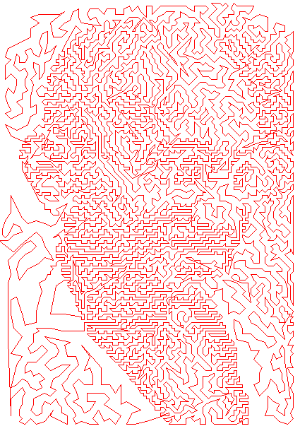

TSP-Art - CS 3102 Term Project
=======

This is a Traveling Salesperson Problem approximator. We use a simple greedy closest-neighbor algorithm to approximate a path that visits every point in our image. We convert our image into a set of points using the Floyd-Steinberg dithering algorithm, choose a point in resulting set to start the TSP from, and then use a brute-force Theta(n^2) algorithm to find the next closest points. 

After the initial path is created, we use a Theta(n^3) algorithm to remove any intersections between edges. This is done by comparing every possible pair of edges in the path, checking to see if they cross each other, uncrossing the edges, and then looping through the points between the endpoints of the edges to reverse their direction. This is run for each frame so that the user can see each intersection being removed.

Below is an example of a completed TSP approximation using our program:

Feel free to use this code, but just be sure to reference us!